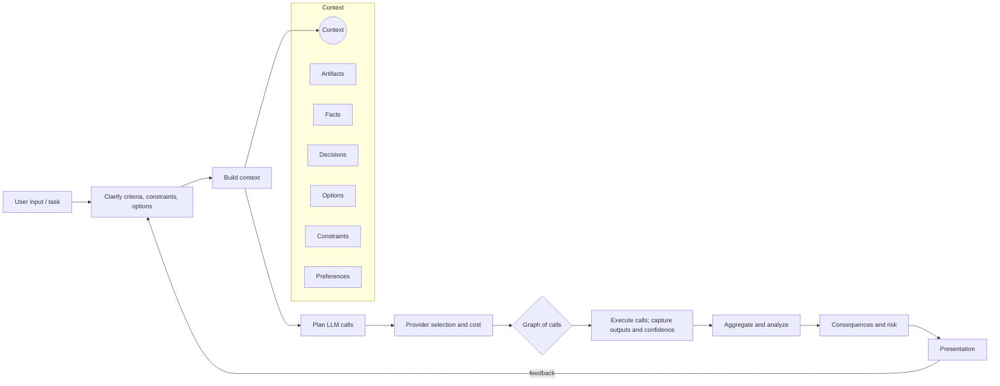

# Roadmap for dossier
---
## Objective

- All-round assistant for data-driven decision making under uncertainty.

> Hypothesis: The need for a decision making assistant is every growing owing to the increase in complexity of decisions and the increase in information available to make the decision.
---
## Features
- All round: Analyzing information in a contextual manner to make professional, personal and interpersonal decisions.
- Cost-aware: Before analyzing the issue, the engine estimates and informs the cost and the information required to make the decision; allowing full control to user to increase or decrease the scope and depth of the analysis.
- Systematic: Clean 4 step approach to decision making.
    1. Clarify: Criteria, constraints, options and issue. 
    2. Information Collection: Identifying the different unknown facts, options and opinions. Communicate the assumptions made in the process.
    3. Consequences and Risk Management: For each option, sketch best / base / worst outcomes and key risks.
    4. Analysis: Analyzing the collected infomation in a systematic manner based on the criteria and constraints.
    5. Presentation: Presenting the analysis in the requested format.

- Intuitive and Accesible: API and GUI Access - other LLMs can call it as a tool, humans can use it intuitively 
- Collaboration Friendly: Portable to different formats and platforms, sharable with others, templatable for different use cases.
- Fully customizable: Customizable to different criteria, constraints, options and issue. Type of analysis, depth and breadth of analysis. Ability to add new criteria, constraints, options and issue.
- Transparent pricing: Pricing on the GUI is transparent and easy to understand - markup of 0.01$/8 INR per decision made. 
- Open-Source: Open-source and free to use, modify and distribute.
- Scale Independent - Consumer First, Enterprise Friendly
- Technology Agnostic - Not binding to any specific LLM provider or API.
> Hypothesis: Even if ASI is achieved, there will be a need for a system that can reason contextually given your information. 
- Privacy Friendly: Knob for data collection and usage
     - Data Collection: Four levels: No Data Collection, data collection but only for personalization, data collection but to improve the engine for everyone, data collection to sell your data to third parties - from which you get a percentage of the revenue earned - By default, data collection but only to improve the engine for everyone - can be _easily_ changed. 
     - Local Model Option - Ability to choose model differently for each step and for the entire engine.
     - Masking of information - Ability to mask information from the cloud APIs if needed using local models.

- Confidence and Calibration: Ability to measure the confidence of the model in its output using heuristics including quality of sources used, degree of the leap made, assumpitons etc.
- Benchmark: Ability to benchmark on a list of given problems and scenarios. This is also useful in creating an environment for training different components of the engine.
---
## Technical Implementation
- $N$ LLM Calls $(X_1, X_2, \dots X_n)$ each of the form $(I_i, P_i, O_i, C_i)$ where $I_i$ is the input, $P_i$ is the provider and $O_i$ is the output and $C_i$ is the confidence score. The LLM calls are connected in a directed graph $G$ where $X_i$ is connected to $X_j$ if $O_i$ is used in $C_j$.
- A typical context can contain items from the following categories:
    - Artifacts (e.g. documents, emails, etc.) $(D_1, D_2, \dots D_m)$
    - Facts (e.g. information about the user, the organization, the task, etc.) $(F_1, F_2, \dots F_k)$
    - Decisions (e.g. decisions made in the past, decisions to be made in the future, etc.) $(D_1, D_2, \dots D_l)$
    - Options (e.g. options to choose from, etc.) $(A_1, A_2, \dots A_p)$
    - Constraints (e.g. cost constraints on the decision, etc.) $(B_1, B_2, \dots B_q)$
    - Preferences (e.g. historical preferences for the decision, etc.) $(E_1, E_2, \dots E_r)$
    - ... [add more as needed]
- Model Choice: Ability to choose model differently for each step and for the entire engine. Each model is a noisy input-output function. The model is more reliable for some tasks and less reliable for others. Using different contexts and multiple inference calls with reliable context windows can improve the reliability of the model. Each model call is associated with a confidence score. The confidence score is 0.5 by default and is updated based on a) hueristics, b) user feedback c) known failure modes of the model d) observations from the context and the output.

The pipeline is implemented in the following way:

---

## Design
---
## Business Model

The dossier project follows a dual-revenue open-source model that balances accessibility with sustainability. The core engine remains fully open-source, allowing users to self-host and modify the system freely, fostering community innovation and trust through transparency. Revenue is generated through two primary channels: a consumer-facing platform that applies a minimal markup (0.01$/8 INR per decision) on top of underlying LLM API costs, ensuring affordability while covering infrastructure and development. This markup will not be there in early stages of development and will be increased gradually as the project matures. The main source of revenue will be from enterprise AI solutions that offer custom integrations, dedicated support, advanced analytics, and white-label deployments for organizations requiring specialized decision-making workflows. 

> Hypothesis: The cost of development of software will go down exponentially over time. Therefore software can not be a moat. By ensuring that the core engine is open-source and auditable, one can ellicit customer trust. 

---

## How is this different than XYZ?

At the time of starting this project, I don't know of any other open-source product that does this with the same business model.

---

## Niche Examples for Personal Decision Making

### Example 1: Buying a home in Mumbai

### Example 2: Deciding next steps in life after a career break

### Example 3: Deciding on a new laptop

### Example 4: Deciding on a new car

### Example 5: How big should my marriage be

### Example 6: Where should I invest my money

### Example 7: Why should I meditate?

---